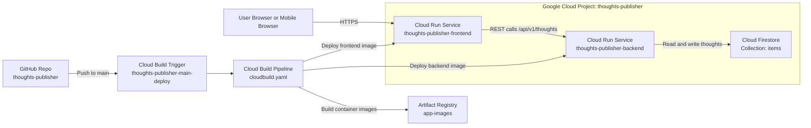

# Thoughts Publisher

A two-service Python FastAPI app to capture and publish thoughts with markdown content. Thoughts are listed in descending publish date and grouped by month.

## Architecture

- `frontend` (FastAPI + Jinja2): responsive UI (desktop and mobile)
- `backend` (FastAPI + Firestore): REST API and persistence
- Firestore collection default: `items`
- Deploy target: Cloud Run (frontend + backend)

## Visual Architecture (GCP)



### Component + Product Mapping

- `frontend/app/main.py` -> **Cloud Run** service `thoughts-publisher-frontend` (us-central1)
- `backend/app/main.py` -> **Cloud Run** service `thoughts-publisher-backend` (us-central1)
- Thought storage (`items`) -> **Cloud Firestore** (Native mode, us-central1)
- Build/deploy automation -> **Cloud Build** (`cloudbuild.yaml`)
- Container image storage -> **Artifact Registry** repo `app-images`
- CI/CD event source -> **Cloud Build GitHub Trigger** `thoughts-publisher-main-deploy`
- Source control -> **GitHub** repo `luisagcenteno84/thoughts-publisher` (after auth + repo creation)

## Endpoints

Backend:
- `GET /health`
- `GET /api/v1/test`
- `GET /api/v1/thoughts`
- `POST /api/v1/thoughts`

Frontend:
- `GET /`
- `GET /health`
- `GET /api/v1/test`
- `POST /thoughts`

## Local Development

```powershell
docker compose up --build
```

- Frontend: `http://localhost:8081`
- Backend: `http://localhost:8080`

## GCP Bootstrap and Deploy

1. Bootstrap project and resources:

```powershell
.\scripts\bootstrap_gcp.ps1 -ProjectId "<PROJECT_ID>" -Region "us-central1"
```

2. One-time deploy:

```powershell
.\scripts\deploy_once.ps1 -ProjectId "<PROJECT_ID>" -Region "us-central1" -BackendService "<APP_SLUG>-backend" -FrontendService "<APP_SLUG>-frontend" -FirestoreCollection "items"
```

3. Create Cloud Build GitHub trigger:

```powershell
.\scripts\create_trigger.ps1 -ProjectId "<PROJECT_ID>" -GithubOwner "<GITHUB_OWNER>" -RepoName "<APP_SLUG>" -TriggerName "<APP_SLUG>-main-deploy"
```

## Cloud Build Trigger Behavior

On push to `main`, `cloudbuild.yaml`:
- builds both images
- pushes to Artifact Registry
- deploys backend
- resolves backend URL
- deploys frontend with `BACKEND_BASE_URL`

## AI Runbook

When running this repo with an AI coding agent:

1. Verify tools and auth: `git`, GitHub auth, `gcloud`, Docker.
2. Keep naming aligned:
   - repo = project id = app slug
   - backend service = `<app-slug>-backend`
   - frontend service = `<app-slug>-frontend`
   - trigger = `<app-slug>-main-deploy`
3. If app slug is unavailable in GCP project ids, append short suffix and use it everywhere.
4. Deploy with `scripts/deploy_once.ps1` after bootstrap.
5. Validate:
   - backend `/health` and `/api/v1/test`
   - frontend `/health` and `/api/v1/test`

## Repo Layout

- `backend/app/main.py`
- `frontend/app/main.py`
- `frontend/app/templates/index.html`
- `frontend/app/static/styles.css`
- `cloudbuild.yaml`
- `docker-compose.yml`
- `scripts/bootstrap_gcp.ps1`
- `scripts/create_trigger.ps1`
- `scripts/deploy_once.ps1`
